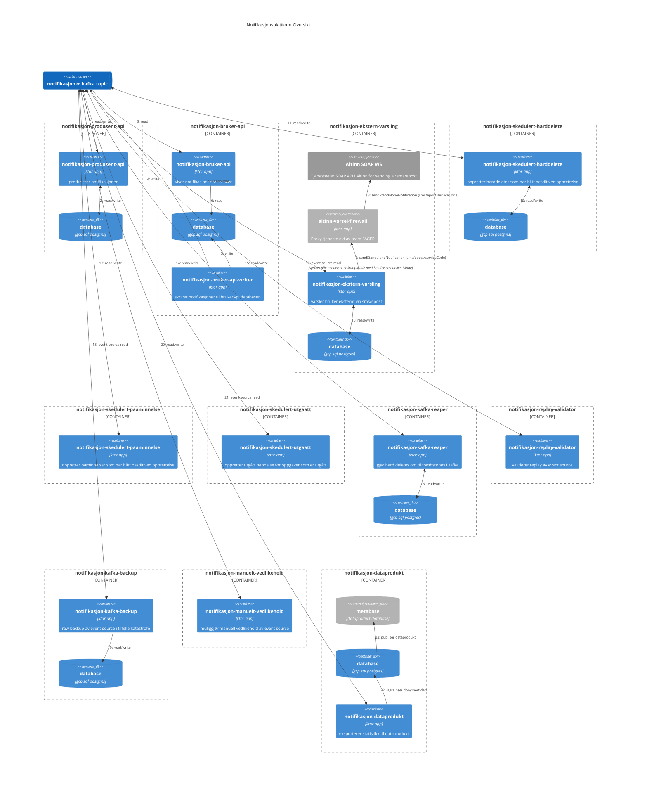

# Notifikasjoner for arbeidsgivere

Dette repoet inneholder notifikasjonsplatformen for arbeidsgivere.

Har du tenkt å bruke plattformen eller lurer på hva den er kan du se i [brukerdokumentasjonen](https://navikt.github.io/arbeidsgiver-notifikasjon-produsent-api/)
Kilden til brukerdokumentasjonen finnes i [docs](docs) mappen.

Har du Spørsmål? Ta kontakt med teamet på Slack i kanalen #arbeidsgiver-notifikasjon eller #team-fager.

## Overordnet systemdokumentajon

Notifikasjonsplattformen består av flere applikasjoner bygget rundt en [Event Sourcing](https://martinfowler.com/eaaDev/EventSourcing.html) arkitektur.
Hendelser publiseres til kafka topicen [fager.notifikasjon](app/nais/nais-kafka-topic.yaml).
Hver applikasjon konsumerer hendelser fra denne topicen og bruker hendelsene som kilde til å bygge opp sine modeller.

Følgende diagram viser en oversikt over de forskjellige applikasjonene og hvordan de er koblet sammen.



### Applikasjoner

#### notifikasjon-produsent-api

[notifikasjon-produsent-api](app/src/main/kotlin/no/nav/arbeidsgiver/notifikasjon/produsent) brukes av produsenter for å opprette saker, beskjeder, oppgaver og kalenderavtaler.
Produsenter kaller applikasjonen gjennom et GraphQL API. Applikasjonen oppretter hendelser på kafka topicen [fager.notifikasjon](app/nais/nais-kafka-topic.yaml) basert på de mutations som produsenter gjør via APIet.
Applikasjonen har et register for hvilke produsenter som har tilgang til hvilke merkelapper som definert i [arbeidsgiver-notifikasjon-produsenter](https://github.com/navikt/arbeidsgiver-notifikasjon-produsenter).
Den har en egen database som brukes for bl.a. idempotens sjekk og validering.
Applikasjonen er deployet til nais med følgende definisjon: [prod-gcp-produsent-api.yaml](app/nais/prod-gcp-produsent-api.yaml)

#### notifikasjon-bruker-api / notifikasjon-bruker-api-writer

[notifikasjon-bruker-api](app/src/main/kotlin/no/nav/arbeidsgiver/notifikasjon/bruker) brukes av min side arbeidsgiver og notifikasjon-widget for å vise innloggede arbeidsgivere sine notifikasjoner og saker.
appen er delt i to (writer/reader) for økt robusthet. De deler samme database på gcp. applikasjon eksponerer et GraphQL API som klientene bruker for å hente data til visning.
Det blir også produsert noen hendelser baser på brukerinteraksjon, f.eks bruker klikket på en notifikasjon.

#### notifikasjon-ekstern-varsling

[notifikasjon-ekstern-varsling](app/src/main/kotlin/no/nav/arbeidsgiver/notifikasjon/ekstern_varsling) sender eksterne varsler
til arbeidsgivere via Altinn sitt SOAP API (https://altinn.github.io/docs/api/tjenesteeiere/soap/endepunkt-liste/#notificationagencyexternal).
Som et risikominimerende tiltak gjøres dette via en dedikert proxy-tjeneste [altinn-varsel-firewall](https://github.com/navikt/altinn-varsel-firewall) som er eid av team FAGER.
notifikasjon-ekstern-varsling konsumerer hendelser fra kafka topicen og registrerer/skedulerer varsler for notifikasjoner som skal ha det.  
Ekstern varsling har en egen database som brukes for å lagre skedulerte varsler og status på varsler. Når varsler er sendt blir det lagret en hendelse på kafka topicen med status på varslingen iht. svar fra Altinn sitt API.
Applikasjonen har retry mekanismer som håndterer ustabilitet i Altinn sitt API.

#### notifikasjon-skedulert-harddelete

[notifikasjon-skedulert-harddelete](app/src/main/kotlin/no/nav/arbeidsgiver/notifikasjon/skedulert_harddelete) konsumerer hendelser fra kafka topicen og oppretter harddeletes som har blitt bestilt ved opprettelse.
Applikasjonen har en egen database som brukes for å lagre skedulerte harddeletes og sender disse på kafka topic når tidspunktet tilsier det skal gjøres.

#### notifikasjon-skedulert-paaminnelse

[notifikasjon-skedulert-paaminnelse](app/src/main/kotlin/no/nav/arbeidsgiver/notifikasjon/skedulert_påminnelse) konsumerer hendelser fra kafka topicen og oppretter påminnelser som har blitt bestilt ved opprettelse.
Dette er funksjonalitet tilknyttet oppgave. Når en oppgave ikke er løst og påminnelsestidspunkt har passert så vil det bli laget en påminnelse med eller uten ekstern varsling avhengig av hva produsenten har bestilt.

#### notifikasjon-skedulert-utgaatt

[notifikasjon-skedulert-utgaatt](app/src/main/kotlin/no/nav/arbeidsgiver/notifikasjon/skedulert_utgått) konsumerer hendelser fra kafka topicen og oppretter utgått hendelse for oppgaver som er utgått.
Dette er funksjonalitet tilknyttet oppgave. Når en oppgave ikke er løst og den har en frist som er passert vil det bli laget en utgått hendelse.
Utgått hendelsen sendes på kafka topic og vil endre tilstand på oppgaven og vil bli vist til arbeidsgiver via bruker-api.


#### notifikasjon-kafka-reaper

[notifikasjon-kafka-reaper](app/src/main/kotlin/no/nav/arbeidsgiver/notifikasjon/kafka_reaper) konsumerer hendelser fra kafka topicen og gjør hard deletes om til tombstones i kafka.
Applikasjonen holder styr på alle hendelser tilknyttet et aggregat og tombstoner alle relaterte hendelser når et aggregat blir slettet.
Dette gjøres for å ivareta juridiske krav om sletting og for å støtte varierende hjemmel for datalagring hos forskjellige produsenter. En produsent kan når som helst slette sin data fra plattformen vha hard delete endepunktet.
Produsenter kan også ved opprettelse av aggregater bestille hard deletes som skal skje på et senere tidspunkt (se notifikasjon-skedulert-harddelete i eget avsnitt).

#### notifikasjon-replay-validator

[notifikasjon-replay-validator](app/src/main/kotlin/no/nav/arbeidsgiver/notifikasjon/replay_validator) konsumerer hendelser fra kafka topicen og validerer replay av event source.
Som et tiltak for å sikre at event source er robust og kan håndtere replay av hendelser så validerer denne applikasjonen at alle hendelser er kompatible med hendelsemodellen i kode.
Replay gjøres kontinuerlig i de fleste applikasjonene via delt `replayPeriodically` funksjonalitet. I tillegg til periodevis replay gjør replay-validatoren en full replay av event source ved oppstart.

#### notifikasjon-kafka-backup

[notifikasjon-kafka-backup](app/src/main/kotlin/no/nav/arbeidsgiver/notifikasjon/kafka_backup) konsumerer hendelser fra kafka topicen og tar en raw backup av event source i tilfelle katastrofe.

#### notifikasjon-manuelt-vedlikehold

[notifikasjon-manuelt-vedlikehold](app/src/main/kotlin/no/nav/arbeidsgiver/notifikasjon/manuelt_vedlikehold) brukes til ad hoc administrasjon av hendelsene. Som følge av uventede feil har det oppstått behov for å rydde i hendelser som er blitt publisert.

#### notifikasjon-dataprodukt

[notifikasjon-dataprodukt](app/src/main/kotlin/no/nav/arbeidsgiver/notifikasjon/dataprodukt) eksporterer pseudonymisert statistikk til [dataprodukt i metabase](https://metabase.ansatt.nav.no/collection/1039-team-fager).
Denne statistikken brukes til å lage dashboards og rapporter som produsenter selv kan bruke for innsikt i bruk av plattformen.

## Devops

### Prerequisites

For devops av notifikasjonsplattformen er det nødvendig at naisdevice, nais cli og kubectl er installert.

Se: https://doc.nais.io/operate/how-to/command-line-access/?h=

### Lokal utvikling og tester

For lokal utvikling benyttes docker-compose til å starte nødvendige platform tjenester (postgres, kafka etc). Vi har god erfaring med  [colima](https://github.com/abiosoft/colima).

1. `colima start`
2. `docker-compose up` (må kjøres i rot-mappen til prosjektet)

Lokal app startes ved å kjøre main metoden i LocalMain.kt.

Apiene blir da å nå på:
* http://ag-notifikasjon-produsent-api.localhost:8081/api/graphql
* http://ag-notifikasjon-bruker-api.localhost:8081/api/graphql

Hvert api kan inspiseres vha hostet graphql ide:
* http://ag-notifikasjon-produsent-api.localhost:8081/ide
* http://ag-notifikasjon-bruker-api.localhost:8081/ide

For at dette skal virke må man sende med riktig auth header (Authorization: Bearer <jwt>).
Du kan f.eks. sette opp mod-header plugin i chrome eller firefox.
Bruk LocalhostIssuer til å lage tokens du kan bruke i header.

#### Deploy med reset og rebuild
obs: kun for ikke kritiske apps som f.eks statistikk.
Scale ned replicaset:
`kubectl get replicaset`
`kubectl scale --replicas=0 deployment/notifikasjon-statistikk`
deploy ny app:
- med migrering som nullstiller database til ønsket tidspunkt eller helt.
- med ny consumer-group-id postfix eller set offset vha [nais aiven cli](#koble-direkte-til-en-topic-på-aiven)

#### Koble direkte til DEV databaser

Se nais cli postgres command i dokumentasjonen https://doc.nais.io/operate/cli/reference/postgres/?h=proxy

#### Koble direkte til en topic på aiven

Dersom man trenger å administrere en topic (f.eks. inspisere en topic, eller endre offsets for en consumer group),
så kan man benytte [kafka cli](https://kafka.apache.org/quickstart) kombinert med [nais aiven cli](https://doc.nais.io/cli/commands/aiven/#aiven-command)
kafka-cli kan man laste ned med `./download_kafka_cli.sh` nais aiven [installeres](https://doc.nais.io/operate/cli/how-to/install/).

Det er opprettet en `notifikasjon-devops` applikasjon med read access til topic i dev og prod.
Etter nais aiven er installert kan man opprette applikasjonen. husk å ha valgt riktig context i k8s først:
`nais login`
`nais aiven create --pool nav-prod kafka notifikasjon-devops fager`

Kommandoen over vil gi deg instruks for å generere klienter når du kjører den.
Kopier siste linje fra output og kjør den. F.eks:
`nais aiven get kafka fager-notifikasjon-devops-ad9c851a fager`

Dette genererer noen filer med secrets i en mappe lokalt, og viser hvor disse ble laget.
Man kan med disse credentials bruke kafka-cli f.eks. kafka-console-consumer eler kafka-consumer-groups.

Noen eksempler på bruk:

Set env vars fra genrerert secrets (som f.eks $KAFKA_BROKERS)
```
KAFKA_CONFIG=/var/folders/7d/d3gk6jrx4c31pbjqb3qcyc_r0000gn/T/aiven-secret-1881600168
source $KAFKA_CONFIG/kafka-secret.env
```

i fish:
```
set KAFKA_CONFIG /var/folders/7d/d3gk6jrx4c31pbjqb3qcyc_r0000gn/T/aiven-secret-1881600168
bass "set -a; source $KAFKA_CONFIG/kafka-secret.env"
```

se at $KAFKA_BROKERS er satt fra secrets:
```
echo $KAFKA_BROKERS
```

List offsets for en consumer group (fra listen over consumer groups):
```
.kafka-cli/bin/kafka-consumer-groups.sh --bootstrap-server $KAFKA_BROKERS --command-config $KAFKA_CONFIG/kafka.properties --group bruker-model-builder --describe
```

Dersom man skal endre en offset på en partisjon må consumer group være inaktiv. Dette gjøres enklest ved å skalere ned deployment til 0:
```
kubectl scale --replicas=0 deployment/notifikasjon-dataprodukt 
```

Sett til et bestemt offset på en gitt partisjon for en consumer group:
```
.kafka-cli/bin/kafka-consumer-groups.sh --bootstrap-server $KAFKA_BROKERS --command-config $KAFKA_CONFIG/kafka.properties --group dataprodukt-model-builder-3 --topic fager.notifikasjon:12 --reset-offsets --to-offset 94700 --execute
```

Sett til et bestemt tidspunkt på alle partisjoner for en consumer group:
```
.kafka-cli/bin/kafka-consumer-groups.sh --bootstrap-server $KAFKA_BROKERS --command-config $KAFKA_CONFIG/kafka.properties --group bruker-model-builder-2 --topic fager.notifikasjon --reset-offsets --all-topics --to-datetime 2025-03-13T05:00:00.000 --execute

```

Deretter skalerer man opp igjen til antall replicas som er definert i nais deployment descriptoren (yml):
```
kubectl scale --replicas=1 deployment/notifikasjon-dataprodukt 
```

Hopp over en offset på en gitt partisjon for en consumer group:
```
.kafka-cli/bin/kafka-consumer-groups.sh --bootstrap-server $KAFKA_BROKERS --command-config $KAFKA_CONFIG/kafka.properties --group bruker-model-builder --topic fager.notifikasjon:12 --reset-offsets --shift-by 1 --execute
```


Les topic for en gitt partisjon fra et gitt offset:
```
.kafka-cli/bin/kafka-console-consumer.sh --bootstrap-server $KAFKA_BROKERS --consumer.config $KAFKA_CONFIG/kafka.properties --topic fager.notifikasjon --formatter kafka.tools.DefaultMessageFormatter --property print.value=true --property print.offset=true --partition 12 --offset 124
```

Describe topic:
```
kafka-cli/bin/./kafka-topics.sh --bootstrap-server $KAFKA_BROKERS --command-config $KAFKA_CONFIG/kafka.properties --topic fager.notifikasjon --describe
```

Konsumer topic fra starten, pipe til fil og koble fra når ferdig:
```
.kafka-cli/bin/./kafka-console-consumer.sh --bootstrap-server $KAFKA_BROKERS --consumer.config $KAFKA_CONFIG/kafka.properties --topic fager.notifikasjon --formatter kafka.tools.DefaultMessageFormatter --property print.key=true --property print.value=true --property print.offset=true --property print.timestamp=true --timeout-ms 30000 --from-beginning > dev.fager.notifikasjon.topic
```

## Ticks n' Trips

* start lokal kafka cluster
    * `docker-compose up -d`
* connect til broker
    * `docker exec -it broker bash`
* kjøre command på broker
    * `docker exec -it broker <command>`
* vis broker version
    * `kafka-broker-api-versions --bootstrap-server localhost:9092 --version`
* create topic
    * `kafka-topics --zookeeper $ZK_HOSTS --create --topic fager.notifikasjon --partitions 3 --replication-factor 3`
        * legg til `--if-not-exists` for å kun opprette dersom den ikke eksisterer fra før
* list topics
    * `kafka-topics --zookeeper zookeeper:2181 --list`
    * `kafka-topics --zookeeper zookeeper:2181 --list --exclude-internal`
* describe topic
    * `kafka-topics --zookeeper zookeeper:2181 --topic fager.notifikasjon --describe`
* juster opp antall partisjoner for topic
    * `kafka-topics --zookeeper zookeeper:2181 --alter --topic fager.notifikasjon --partitions 5`
* purge en topic (krever å sette retention lav, så vente, så slette retention)
    * `kafka-configs --zookeeper zookeeper:2181 --alter --entity-type topics --entity-name fager.notifikasjon --add-config retention.ms=1000`
    * _a few moments later_
    * `kafka-configs --zookeeper zookeeper:2181 --alter --entity-type topics --entity-name fager.notifikasjon --delete-config retention.ms`
* list config for en topic
    * `kafka-configs --bootstrap-server localhost:9092 --describe --entity-type topics --entity-name fager.notifikasjon`
* endre config på en topic
    * `kafka-configs --bootstrap-server localhost:9092 --alter --entity-type topics --entity-name fager.notifikasjon --add-config cleanup.policy=compact`
* delete topic
    * `kafka-topics --zookeeper zookeeper:2181 --delete --topic fager.notifikasjon`
* consume en topic og print til console (default from latest)
    * `kafka-console-consumer --bootstrap-server localhost:9092 --topic fager.notifikasjon --formatter kafka.tools.DefaultMessageFormatter --property print.key=true --property print.value=true`
    * _from the beginning_ (legg til `--from-beginning`)
        * `kafka-console-consumer --bootstrap-server localhost:9092 --topic fager.notifikasjon --formatter kafka.tools.DefaultMessageFormatter --property print.key=true --property print.value=true --from-beginning`
    * from a specific offset to a specific offset (useful to check compaction)
        * `./kafka-console-consumer.sh --bootstrap-server $KAFKA_BROKERS --consumer.config $KAFKA_CONFIG/kafka.properties -topic fager.notifikasjon --formatter kafka.tools.DefaultMessageFormatter --property print.key=true --property print.value=true --property print.offset=true --partition 12 --offset 80148 --max-messages 5`
* produce til en topic
    * `kafka-console-producer --bootstrap-server localhost:9092 --topic fager.notifikasjon`
* delete messages from a topic
    * `kafka-delete-records.sh --bootstrap-server $KAFKA_BROKERS --offset-json-file delete-records.json`
* inspect a consumer group
    * `kafka-consumer-groups.sh --bootstrap-server $KAFKA_BROKERS --command-config /tmp/kafka.properties --group query-model-builder --describe`
* adjust offset of a consumer group (requires group is inactive, i.e. no running consumers)
    * `kafka-consumer-groups.sh --bootstrap-server $KAFKA_BROKERS --command-config /tmp/kafka.properties --group query-model-builder --topic fager.notifikasjon --reset-offsets --to-earliest --execute`
    * `kafka-consumer-groups.sh --bootstrap-server $KAFKA_BROKERS --command-config /tmp/kafka.properties --group query-model-builder --topic fager.notifikasjon --reset-offsets --shift-by 1 --execute`
    * `kafka-consumer-groups.sh --bootstrap-server $KAFKA_BROKERS --command-config /tmp/kafka.properties --group query-model-builder --topic fager.notifikasjon --reset-offsets --to-datetime 2020-11-01T00:00:00Z --execute`
    * specify partition using `--topic topic:0,1,2`. e.g. reset offset for partition 14 to 5004:
    * `kafka-consumer-groups.sh --bootstrap-server $KAFKA_BROKERS --command-config /tmp/kafka.properties --group query-model-builder --topic fager.notifikasjon:14 --reset-offsets --to-offset 5004 --execute`


ref:
https://medium.com/@TimvanBaarsen/apache-kafka-cli-commands-cheat-sheet-a6f06eac01b


