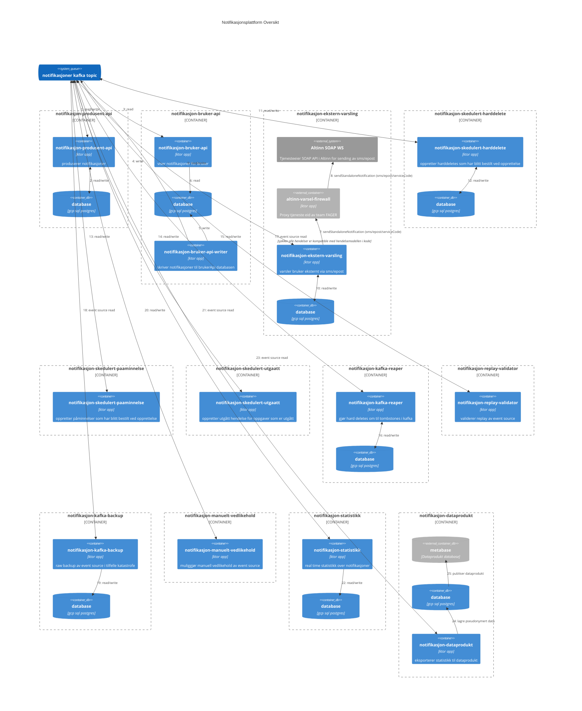

# Notifikasjkonsplattform referanse doc

Notifikasjonsplattformen består av flere applikasjoner bygget rundt en [Event Sourcing](https://martinfowler.com/eaaDev/EventSourcing.html) arkitektur.
Hendelser publiseres til kafka topicen [fager.notifikasjon](app/nais/nais-kafka-topic.yaml).
Hver applikasjon konsumerer hendelser fra denne topicen og bruker hendelsene som kilde til å bygge opp sine modeller.

Følgende diagram viser en oversikt over de forskjellige applikasjonene og hvordan de er koblet sammen.

## Applikasjoner

### notifikasjon-produsent-api

[notifikasjon-produsent-api](app/src/main/kotlin/no/nav/arbeidsgiver/notifikasjon/produsent) brukes av produsenter for å opprette saker, beskjeder, oppgaver og kalenderavtaler. 
Produsenter kaller applikasjonen gjennom et GraphQL API. Applikasjonen oppretter hendelser på kafka topicen [fager.notifikasjon](app/nais/nais-kafka-topic.yaml) basert på de mutations som produsenter gjør via APIet.
Applikasjonen har et register for hvilke produsenter som har tilgang til hvilke merkelapper som definert i [arbeidsgiver-notifikasjon-produsenter](https://github.com/navikt/arbeidsgiver-notifikasjon-produsenter).
Den har en egen database som brukes for bl.a. idempotens sjekk og validering. 
Applikasjonen er deployet til nais med følgende definisjon: [prod-gcp-produsent-api.yaml](app/nais/prod-gcp-produsent-api.yaml)

### notifikasjon-bruker-api / notifikasjon-bruker-api-writer  

[notifikasjon-bruker-api](app/src/main/kotlin/no/nav/arbeidsgiver/notifikasjon/bruker) brukes av min side arbeidsgiver og notifikasjon-widget for å vise innloggede arbeidsgivere sine notifikasjoner og saker.
appen er delt i to (writer/reader) for økt robusthet. De deler samme database på gcp. applikasjon eksponerer et GraphQL API som klientene bruker for å hente data til visning.
Det blir også produsert noen hendelser baser på brukerinteraksjon, f.eks bruker klikket på en notifikasjon.

### notifikasjon-ekstern-varsling 

[notifikasjon-ekstern-varsling](app/src/main/kotlin/no/nav/arbeidsgiver/notifikasjon/ekstern_varsling) sender eksterne varsler 
til arbeidsgivere via Altinn sitt SOAP API (https://altinn.github.io/docs/api/tjenesteeiere/soap/endepunkt-liste/#notificationagencyexternal). 
Som et risikominimerende tiltak gjøres dette via en dedikert proxy-tjeneste [altinn-varsel-firewall](https://github.com/navikt/altinn-varsel-firewall) som er eid av team FAGER.
notifikasjon-ekstern-varsling konsumerer hendelser fra kafka topicen og registrerer/skedulerer varsler for notifikasjoner som skal ha det.  
Ekstern varsling har en egen database som brukes for å lagre skedulerte varsler og status på varsler. Når varsler er sendt blir det lagret en hendelse på kafka topicen med status på varslingen iht. svar fra Altinn sitt API.
Applikasjonen har retry mekanismer som håndterer ustabilitet i Altinn sitt API.

### notifikasjon-skedulert-harddelete

[notifikasjon-skedulert-harddelete](app/src/main/kotlin/no/nav/arbeidsgiver/notifikasjon/skedulert_harddelete) konsumerer hendelser fra kafka topicen og oppretter harddeletes som har blitt bestilt ved opprettelse.
Applikasjonen har en egen database som brukes for å lagre skedulerte harddeletes og sender disse på kafka topic når tidspunktet tilsier det skal gjøres.

### notifikasjon-skedulert-paaminnelse

[notifikasjon-skedulert-paaminnelse](app/src/main/kotlin/no/nav/arbeidsgiver/notifikasjon/skedulert_påminnelse) konsumerer hendelser fra kafka topicen og oppretter påminnelser som har blitt bestilt ved opprettelse. 
Dette er funksjonalitet tilknyttet oppgave. Når en oppgave ikke er løst og påminnelsestidspunkt har passert så vil det bli laget en påminnelse med eller uten ekstern varsling avhengig av hva produsenten har bestilt.

### notifikasjon-skedulert-utgaatt

[notifikasjon-skedulert-utgaatt](app/src/main/kotlin/no/nav/arbeidsgiver/notifikasjon/skedulert_utgått) konsumerer hendelser fra kafka topicen og oppretter utgått hendelse for oppgaver som er utgått.
Dette er funksjonalitet tilknyttet oppgave. Når en oppgave ikke er løst og den har en frist som er passert vil det bli laget en utgått hendelse. 
Utgått hendelsen sendes på kafka topic og vil endre tilstand på oppgaven og vil bli vist til arbeidsgiver via bruker-api.

### notifikasjon-kafka-reaper

[notifikasjon-kafka-reaper](app/src/main/kotlin/no/nav/arbeidsgiver/notifikasjon/kafka_reaper) konsumerer hendelser fra kafka topicen og gjør hard deletes om til tombstones i kafka.
Applikasjonen holder styr på alle hendelser tilknyttet et aggregat og tombstoner alle relaterte hendelser når et aggregat blir slettet.
Dette gjøres for å ivareta juridiske krav om sletting og for å støtte varierende hjemmel for datalagring hos forskjellige produsenter. En produsent kan når som helst slette sin data fra plattformen vha hard delete endepunktet.
Produsenter kan også ved opprettelse av aggregater bestille hard deletes som skal skje på et senere tidspunkt (se notifikasjon-skedulert-harddelete i eget avsnitt).

### notifikasjon-replay-validator

[notifikasjon-replay-validator](app/src/main/kotlin/no/nav/arbeidsgiver/notifikasjon/replay_validator) konsumerer hendelser fra kafka topicen og validerer replay av event source. 
Som et tiltak for å sikre at event source er robust og kan håndtere replay av hendelser så validerer denne applikasjonen at alle hendelser er kompatible med hendelsemodellen i kode.
Replay gjøres kontinuerlig i de fleste applikasjonene via delt `replayPeriodically` funksjonalitet. I tillegg til periodevis replay gjør replay-validatoren en full replay av event source ved oppstart.

### notifikasjon-kafka-backup

[notifikasjon-kafka-backup](app/src/main/kotlin/no/nav/arbeidsgiver/notifikasjon/kafka_backup) konsumerer hendelser fra kafka topicen og tar en raw backup av event source i tilfelle katastrofe.

### notifikasjon-manuelt-vedlikehold

[notifikasjon-manuelt-vedlikehold](app/src/main/kotlin/no/nav/arbeidsgiver/notifikasjon/manuelt_vedlikehold) brukes til ad hoc administrasjon av hendelsene. Som følge av uventede feil har det oppstått behov for å rydde i hendelser som er blitt publisert.

### notifikasjon-statistikk

[notifikasjon-statistikk](app/src/main/kotlin/no/nav/arbeidsgiver/notifikasjon/statistikk) konsumerer hendelser fra kafka topicen og produserer near realtime statistikk over bruk av plattformen. 
Denne statistikken lagres i en database og eksponeres til prometheus for overvåkning.
Se for eksempel [bruk av notifikasjoner](https://grafana.nav.cloud.nais.io/d/vk9LN9I7z/bruk-av-notifikasjoner?orgId=1), [bruk av saker](https://grafana.nav.cloud.nais.io/d/2U4EXBy7z/bruk-av-saker?orgId=1&refresh=30s) og [bruk av ekstern varsling](https://grafana.nav.cloud.nais.io/d/_CEEMTr7z/bruk-av-ekstern-varsling?orgId=1&refresh=30s).

### notifikasjon-dataprodukt

[notifikasjon-dataprodukt](app/src/main/kotlin/no/nav/arbeidsgiver/notifikasjon/dataprodukt) eksporterer pseudonymisert statistikk til [dataprodukt i metabase](https://metabase.ansatt.nav.no/collection/1039-team-fager).
Denne statistikken brukes til å lage dashboards og rapporter som produsenter selv kan bruke for innsikt i bruk av plattformen.

