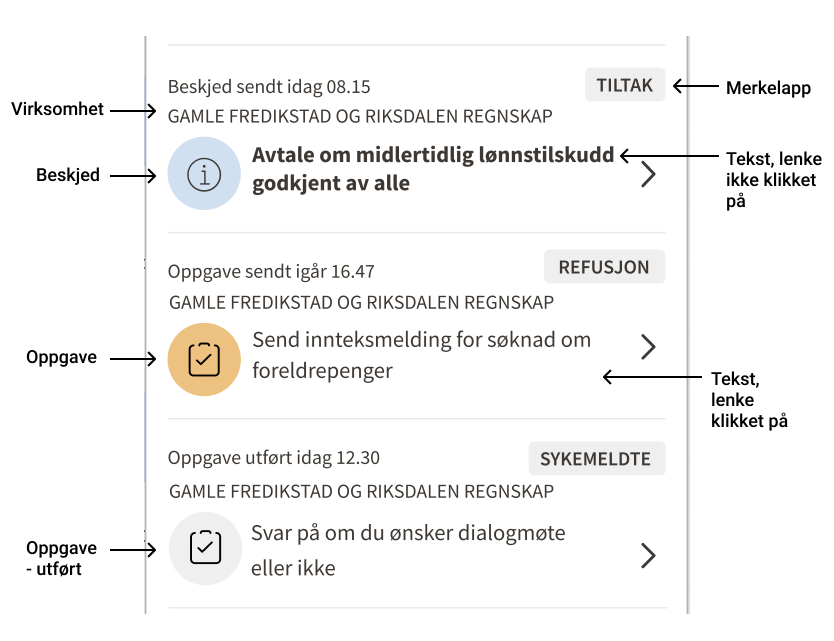

## Onboarding og tilganger

For å få tilgang til API-et må teamet ditt godta [vilkårene](vilkaar.md), ved å registerer dere i repoet [navikt/arbeidsgiver-notifikasjon-produsenter](https://github.com/navikt/arbeidsgiver-notifikasjon-produsenter).
Der er også tilgangsstyring spesifisert.

## Terminologi og beskrivelse av felter

Merkelapp bestems av produsenten og skal gjøre det tydelig for mottaker hvilken domene notifikasjonen er om. T ex sykemeldte eller tiltak. Fet skrift på meldingen betyr at brukern ikke klikket på lenken. Hvilken virksomhet notifikasjonen gjelder vises også.  

Utført oppgave vises med grå ikon i tilegg til teksten "oppgave utført". Beroende av hvordan dere valgt å spesifisere mottakere kan det vare flere i virksomheten som mottat samme oppgave. Oppgaven kan derfor være utført av en annen person en den brukeren som ser "oppgave utført".  

 

Bjella med notifikasjoner er en egen NPM-pakke som hvert enkelt team i tilegg kan plassere i bedriftsmenyen i sin applikasjon (eller direkte i applikasjonen hvis dere ikke bruker bedriftsmenyn). Dette gjør det enklere for arbeidgsiver å kunne navigere mellom oppgaver og beskjeder i forskjellige applikasjoner uten å alltid må inom Min side - arbeidgsiver. 

## Hvordan opprette en beskjed
Når dere lager en GraphQL-spørring burde dere bruke variabler for å skille
det statiske og dynamiske i spørringene.

```graphql
mutation OpprettNyBeskjed(
  $eksternId: String!
  $virksomhetsnummer: String!
  $lenke: String!
) {
  nyBeskjed(nyBeskjed: {
    metadata: {
      eksternId: $eksternId
      virksomhetsnummer: $virksomhetsnummer
    }
    mottakere: [{
      altinn: {
        serviceCode: "1234"
        serviceEdition: "1"
      }
    }]
    notifikasjon: {
      merkelapp: "EtSakssystem"
      tekst: "Du har fått svar på din søknad"
      lenke: $lenke
    }
  }) {
    __typename
    ... on NyBeskjedVellykket {
      id
    }
    ... on Error {
      feilmelding
    }
  }
}
```

Med variabler:
```json
{
  "eksternId": "1234-oppdatering",
  "virksomhetsnummer": "012345678",
  "lenke": "https://dev.nav.no/sakssystem/?sak=1234"
}
```

## Hvordan opprette en oppgave
Følgende mutation oppretter en ny oppgave:

```graphql
mutation OpprettNyOppgave(
  $eksternId: String!
  $virksomhetsnummer: String!
  $lenke: String!
  $tekst: String!
  $grupperingsId: String!
) {
  nyOppgave(nyOppgave: {
    metadata: {
      eksternId: $eksternId
      grupperingsid: $grupperingsId
      virksomhetsnummer: $virksomhetsnummer
    }
    mottakere: [
      {
        altinn: {
          serviceCode: "4321"
          serviceEdition: "1"
        }
      }
    ]
    notifikasjon: {
      merkelapp: "Pensjon"
      tekst: $tekst
      lenke: $lenke
    }
  }) {
    __typename
    ... on NyOppgaveVellykket {
      id
    }
    ... on Error {
      feilmelding
    }
  }
}

```

Med variabler:
```json
{
  "eksternId": "saksnummer-1234",
  "grupperingsId": "saksnummer-1234",
  "virksomhetsnummer": "012345678",
  "tekst": "Du har en søknad du må fylle ut",
  "lenke": "https://dev.nav.no/sakssystem/?sak=1234"
}
```

## Hvordan markere oppgave som utført 
Dere kan markere en oppgave som utført, ved å bruke en av følgende:
- vår ID, som vi returnerte til dere da dere opprettet oppgaven
- deres ID, som dere oppga  som `eksternId` da dere opprettet oppgaven.


```graphql
mutation MarkerOppgaveSomUtfoert($id: ID!) {
  oppgaveUtfoert(id: $id) {
    __typename
    ... on Error {
      feilmelding
    }
  }
}
```

(Eksempel på oppdatering med deres ID kommer senere. Vi skal lage versjon 2, som fikser en typefeil.)

## Hvordan opprette ny sak

```graphql
mutation OpprettNySak(
  $grupperingsid: String!
  $virksomhetsnummer: String!
  $tittel: String!
  $lenke: String!
) {
  nySak(
    grupperingsid: $grupperingsid
    merkelapp: "Tiltak"
    virksomhetsnummer: $virksomhetsnummer
    mottakere: [{
      altinn: {
        serviceCode: "4321"
        serviceEdition: "1"
      }
    }]
    tittel: $tittel
    lenke: $lenke
    initiell_status: MOTTATT
    tidspunkt: "2022-03-01T17:18:00+01" # optional
    overstyrStatustekstMed: "Avtale opprettet" # optional
  ) {
    __typename
    ... on NySakVellykket {
      id
    }
    ... on Error {
      feilmelding
    }
  }
}
```

Merk at vi sender tittel som variabel, siden innholdet er dynamisk (etternavn satt inn).

## Hvordan oppdatere status i sak
Du kan oppdatere status i sak ved å referer til vår ID (id) eller deres id (grupperingsid + merkelapp).

Vår ID:
```graphql
mutation OpprettNySak($id: ID!) {
  nyStatusSak(
    id: $id
    ny_status: UNDER_BEHANDLING
    tidspunkt: "2022-03-01T18:18:00+01" # optional
    overstyrStatustekstMed: "Avtale opprettet" # optional
  ) {
    __typename
    ... on NyStatusSakVellykket {
      id
    }
    ... on Error {
      feilmelding
    }
  }
}
```

Deres ID:
```graphql
mutation OpprettNySak($grupperingsid: String!) {
  nyStatusSakByGrupperingsid(
    grupperingsid: $grupperingsid
    merkelapp: "Tiltak"
    ny_status: UNDER_BEHANDLING
    tidspunkt: "2022-03-01T18:18:00+01" # optional
    overstyrStatustekstMed: "Avtale opprettet" # optional
  ) {
    __typename
    ... on NyStatusSakVellykket {
      id
    }
    ... on Error {
      feilmelding
    }
  }
}
```


## Spesifisere mottakere
Du kan spesifisere mottakerene av notifikasjonen på mange måter.
Det er viktig å spesifisere mottaker riktig, så eventuelle
personopplysninger kun vises til de med tjenestelig behov. Har dere
behov for en annen måte å spesifisere mottakere på, så kontakt oss!

Dette eksempelet viser alle mottakerene vi støtter:
```graphql
mutation OpprettNyBeskjed(
    $eksternId: String! 
    $virksomhetsnummer: String!
    $lenke: String!
    $reporteeFnr: String!
    $ansattFnr: String!
    $naermesteLederFnr: String!
) {
nyBeskjed(
nyBeskjed: {
            metadata: { eksternId: $eksternId, virksomhetsnummer: $virksomhetsnummer }
            mottakere: [
                {
                    altinn: {
                        serviceCode: "1234",
                        serviceEdition: "1"
                    }
                }
                {
                    altinnRolle: {
                        roleDefinitionCode: "DAGL"
                    }
                }
                {
                    altinnReportee: {
                        fnr: $reporteeFnr
                    }
                }
                {
                    naermesteLeder: {
                        ansattFnr: $ansattFnr
                        naermesteLederFnr: $naermesteLederFnr
                    }
                }
            ]
            notifikasjon: {
                merkelapp: "EtSakssystem"
                tekst: "Du har fått svar på din søknad"
                lenke: $lenke
            }
        }
    ) {
        __typename
        ... on NyBeskjedVellykket {
            id
        }
        ... on Error {
            feilmelding
        }
    }
}
```

## Opprette beskjed med SMS og e-post
SMS eller e-post skal ikke inneholde noen personopplysninger men si generelt hva varslet gjelder.
F.eks. “_Du har en ny sykemelding. Logg inn på NAV på Min side – arbeidsgiver for å finne den_”. 
Se bruksvilkårene for flere detaljer.

Vi støtter ekstern varsling der dere som produsent har kontaktinformasjon (telefonnummer eller e-postadresse) til den som skal varsles. 

Vil dere sende sms/epost til arbeidsgivere basert på tjenestekode i Altinn eller KoFuVi-registeret, så ta kontakt med oss,
så vi kan prioritere utvikling av dette.

```graphql
mutation OpprettNyBeskjed(
  $eksternId: String!
  $virksomhetsnummer: String!
  $lenke: String!
  $epostHtmlBody: String!
  $ansattFnr: String!
  $naermesteLederFnr: String!
  $tlf: String!
  $epost: String!
) {
  nyBeskjed(
    nyBeskjed: {
      metadata: { eksternId: $eksternId, virksomhetsnummer: $virksomhetsnummer }
      mottakere: [{
        naermesteLeder: {
          ansattFnr: $ansattFnr
          naermesteLederFnr: $naermesteLederFnr
        }
      }]
      notifikasjon: {
        merkelapp: "Sykemelding"
        tekst: "Du har mottatt en ny sykemelding."
        lenke: $lenke
      }
      eksterneVarsler: [
        {
          sms: {
            mottaker: {
              kontaktinfo: {
                tlf: $tlf
              }
            }
            smsTekst: "Du har en ny sykemelding. Logg inn på NAV på Min side – arbeidsgiver for å finne den"
            sendetidspunkt: {
              sendevindu: NKS_AAPNINGSTID
            }
          }
          epost: {
            mottaker: {
              kontaktinfo: {
                epostadresse: $epost
              }
            }
            epostTittel: "Du har en ny sykemelding."
            epostHtmlBody: $epostHtmlBody
            sendetidspunkt: {
              sendevindu: LOEPENDE
            }
          }
        }
      ]
    }
  ) {
    __typename
    ... on NyBeskjedVellykket {
      id
    }
    ... on Error {
      feilmelding
    }
  }
}
```
med variabler
```json
{
  "eksternId": "1234556",
  "virksomhetsnummer":"012345678",
  "lenke": "https://dev.nav.no/sykemelding/12345",
  "tlf": "123445",
  "epost": "foobar@baz.no",
  "epostHtmlBody": "<h1>Du har en ny sykemelding.</h1><br>Logg inn på NAV sin hjemmeside som arbeidsgiver. <br> Hilsen NAV",
  "ansattFnr": "1234",
  "naermesteLederFnr": "1234"
}
```

## Hvordan slette notifikasjoner og saker automatisk
For å slette en notifikasjon helt, både fra databaser og kafka-topics, så kan dere
bruker `hardDeleteNotifikasjon`. Da slettes informasjonen knyttet til notifikasjonen
helt.

- Sletting av notifikasjoner kan være forvirrende for brukere. Vi
  anbefaler at dere lar notifikasjonene
  være til dere har en grunn til å slette dem.
- Bruk soft-delete hvis dere vil skjule notifikasjonen for brukeren.
- Bruk hard-delete hvis dere ikke lengere har hjemmel for å beholde dataen.

Man skrur på automtisk sletting når man lager en sak/notifikasjon og/eller oppdaterer en.

Dette eksempelet viser hvordan man automatisk sletter en sak etter 5 måneder.

```graphql
mutation OpprettSakMedAutomatiskSletting {
  nySak(
    # Dette argumentet
    hardDelete: {
      om: "P5M" # Fem månder (se https://en.wikipedia.org/wiki/ISO_8601#Durations for mer info)
    }
    grupperingsid: "12345"
    merkelapp: "Tiltak"
    virksomhetsnummer: "000000000"
    initiell_status: MOTTATT
    mottakere: [{
      altinn: {
        serviceEdition: "1" 
        serviceCode: "1" 
      }
    }]
    tittel: "Du har en ny avtale"
    lenke: "https://dev.nav.no/avtale/12345"
  ) {
    __typename
    
  }
}
```

## Hvordan slette notifikasjoner og saker manuelt
En soft-delete markerer en notifikasjon eller sak som slettet i våre systemer. Det er ikke mulig
å angre på en soft delete, men dataen vil ligge igjen i databasene våre, så det kan graves fram. Eksempel på soft delete av notifikasjon:
```graphql
mutation SoftDeleteNotifikasjon($id: ID!) {
    softDeleteNotifikasjon(id: $id) {
        __typename
        ... on Error {
            feilmelding
        }
    }
}
```

Dere kan også spesifisere notifikasjonen med `merkelapp` og `eksternId` ved bruk av `softDeleteNotifikasjonByEksternId_V2`. Her er en liste over de forskjellige variantene (sak vs notifikasjon, soft vs hard, by id vs by ekstern id):
- `softDeleteNotifikasjon(id)`
- `softDeleteNotifikasjonByEksternId_V2(merkelapp, eksternId)`
- `hardDeleteNotifikasjon(id)`
- `hardDeleteNotifikasjonByEksternId_V2(merkelapp, eksternId)`
- `softDeleteSak(id)`
- `softDeleteSakByGrupperingsid(merkelapp, grupperingsid)`
- `hardDeleteSak(id)`
- `hardDeleteSakByGrupperingsid(merkelapp, grupperingsid)`

## Hvor lenge vises notifikasjonen for mottakere og lagres i loggene?
Oppgaver og beskjeder vises i bjella så lenge arbeidsgivere fortsatt
har tilgang å se dem og notifikasjonen ikke er slettet. Dere som
produsent må derfor vurdere hvor lenge notifikasjonen bør vises for
mottakeren og lagres i loggene. Dere utfør sletting med hjelp av
våre API-er for sletting, se 
[API dokumentasjon](https://navikt.github.io/arbeidsgiver-notifikasjon-produsent-api/api/).
Vi jobber med funksjonalitet der produsenten vid opprettelse av en
notifikasjon kan definere hvor lenge den skal vises for mottakeren
og hvor lenge loggene skal lagres.

