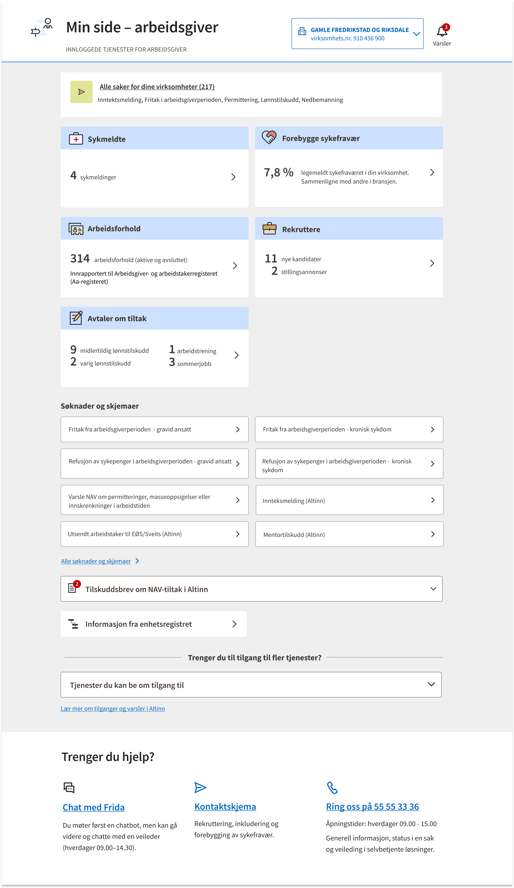
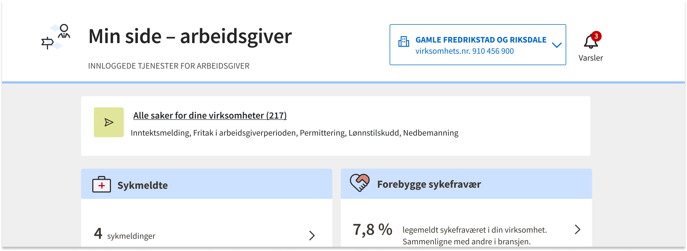
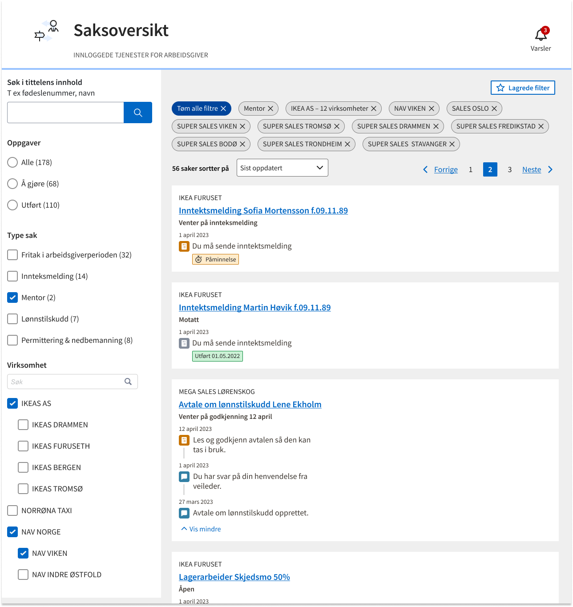

Notfikasjoner og saker gjør det enkelt for arbeidsgivere å få med seg viktig informasjon og oppgaver som venter. Dere som lager tjenester til arbeidsgivere velger hva dere ønsker å sende notifkasjoner om på notifkasjonsplatformen. Dere kan også velge å vise en søknad eller skjema som en «sak» på Min side – arbeidsgiver så arbeidsgiveren lett kan finne den igjen. Se hvordan det ser ut på [testversjonen i labs](https://arbeidsgiver.labs.nais.io/min-side-arbeidsgiver/?) . 

## Hvilket problem skal vi løse? 

- __For arbeidsgivere:__
Arbeidsgivere må gå rundt og lete på mange steder for å få kontroll på hva de må gjøre og hva som skjer med saken deres. Arbeidsgiver sliter også med å finne tilbake til skjemaer og søknader de sendt inn til NAV. Dette skaper en usikkerhet og et unødvendig merarbeide for arbeidgsiver som ofte har en travel hverdag.

- __Internt i NAV:__
Tidligere har Min side - arbeidgsiver integrert mot API-er for å kunne vise at noe krever arbeidsgivers oppmerksomhet på en viss tjeneste. Dette har vist seg å være vanskelig å vedlikeholde, da API-er endres og dataen blir upålitilig. De enkelte teamene føler lite eierskap til hva som vises på Min side - arbeidsgiver og teamet vårt blir fort en flaskehals. 

## Oppgaver og beskjeder 
Oppgaver og beskjeder vil være synlig for arbeidsgivere som er logget inn i NAV sine tjenester. Når det finns nye beskjeder eller oppgaver har bjella en rød sirkel med et tall som viser hvor mange. 

Når arbeidsgiver trykker på bjella kan de se oppgaver og beskjeder på tvers av virksomheter. 

__Beskjed__

Dette er en typisk informasjonsmelding til arbeidsgiver. Denne krever ikke nødvendigvis noe mer handling fra arbeidsgiver. For eksempel, «Vi har mottat en søknad...». 

 

__Oppgave__

Oppgave brukes når du trenger at arbeidsgiver skal gjøre en konkret handling. For eksempel «Du må godkjenne avtalen innen...» Du som produsent må holde styr på når oppgaven er fullført. 
Arbeidsgiver vil da se oppgaven som utført. Du kan velge å sette en frist på oppgaven. Fristen vises til arbeidsgiver. 
Blir oppgaven ikke utført innen fristen vil den automatisk få status “utgått”. Blir en oppgave ikke utført kan du sende en påminnelse.

__Varsler på e-post eller SMS__

Vi støtter ekstern varsling på SMS eller e-post der dere som produsent har kontakinformasjon. 

## Sak
Lag en sak og bruk statusoppdatering-event for at vise en søknad eller skjema som en «sak» på Min side – arbeidsgiver så arbeidsgiveren lett kan finne den igjen.  

Hvis en sak eller søknad har endret status kan produsenten sende et Statusoppdatering-event. Produsenten må velge én av våre 3 globale statuser: MOTTATT, UNDER_BEHANDLING eller FERDIG. Hvis produsenten ønsker, kan teksten i statusen overstyres med en egen tekst t ex «Venter på dokumentasjon».  

__Saksprosess:__
Beskjeder, oppgaver og statusoppdatering kan alle grupperes på en sak for å vise hva som skjedd og kommer å skje med saken.   
Status: under arbeid  

## Hvordan komme i gang? 
- Bruksvilkår: Bli kjent med deres ansvar som produsent og signer [bruksvilkårene](https://navikt.github.io/arbeidsgiver-notifikasjon-produsent-api/bruksvilk%C3%A5r/) .

- [API dokumentasjon](https://navikt.github.io/arbeidsgiver-notifikasjon-produsent-api/api/) for notifikasjoner til arbeidsgivere.

- Har du spørsmål? Kontakt oss på slack: [#arbeidsgiver-notifikasjon](https://nav-it.slack.com/archives/C02F7211DQ8).

