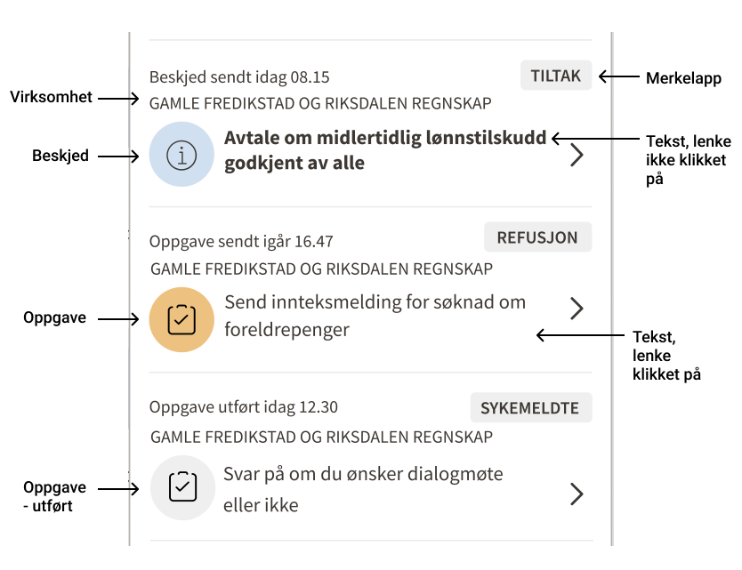

Notfikasjoner for arbeidsgivere gjør det enkelt for arbeidsgivere å få med seg viktig informasjon og oppgaver som venter. Dere som lager tjenester til arbeidsgivere velger hva dere ønsker sende notifkasjoner om på notifkasjonsplatformen. Se hvordan det ser ut på [testversjonen i labs](https://arbeidsgiver.labs.nais.io/min-side-arbeidsgiver/?) . 

## Hvilket problem skal vi løse? 

- __For arbedsgivere:__
Arbeidsgivere må gå rundt og lete på mange sted for å få kontroll på hva de må gjøre og hva som skjer med saken deres. I tilegg kan arbeidsgiverne ha mange forskjellig virksomheter å holde koll på. Dette skaper en usikkerhet og onødvendig merarbeide for arbeidgsiver som ofte har en travel hverdag. 

- __Internt i NAV:__
Tidligere har Min side - arbeidgsiver integrert mot API:er for å kunne vise at noe krever arbeidsgivers oppmerksomhet på en vis tjeneste. Dette har viset seg vare vanskelig å vedlikeholde da API:er endres og dataen blir upålitilig. De enkelte teamene føler lite eierskap til hva som vises på Min side - arbeidsgiver og teamet vårt blir fort en flaskehals. 

## Oppgaver og beskjeder 
Oppgaver og beskjeder vil være synlig for arbeidsgivere som er logget inn i NAV sine tjenester. Vi støtter ikke varsel på SMS eller e-post (men håper å støtte det i fremtiden). Når det finns nye beskjeder eller oppgaver har bjella en rød sirkel med et tall som viser hvor mange. 

Når arbeidsgiver trykker på bjella kan de se oppgaver og beskjeder på tvers av virksomheter. 

Bjella med notifikasjoner er en egen NPM-pakke som hvert enkelt team i tilegg kan plasere i bedriftsmenyn i sin applikasjon (eller direkte i applikasjon hvis dere ikke bruker bedriftsmenyn). Dette gjør det enklere for arbeidgsiver å kunne navigere mellom oppgaver og beskjeder i forskjellige applikasjoner uten å alltid må inom Min side - arbeidgsiver. 

## Sånn funker det 

__Beskjed__

Dette er en typisk informasjonsmelding til arbeidsgiver. Denne krever ikke nødvendigvis noe mer handling fra arbeidsgiver. For eksempel, «Vi har mottat en søknad...». 

 

__Oppgave__

Oppgave brukes når du trenger at arbeidsgiver skal gjøre en konkret handling. For eksempel «Du må godkjenne avtalen innen...» Du som produsent må holde styr på når oppgaven er fullført. Arbeidsgiver vil da se oppgaven som utført. 

__Hva med varsler på e-post eller SMS?__

Vi støtter ikke varsel på SMS eller e-post (men håper å støtte det i fremtiden). 

__Hvor lenge vises notifikasjonen for mottakere og lagres i loggene?__

Oppgaver og beskjeder vises i bjella så lenge arbeidsgivere fortsatt har tilgang å se dem og notifikasjonen ikke er slettet. Dere som produsent må derfor vurdere hvor lenge notifikasjonen bør vises for mottakeren og lagres i loggene. Dere utfør sletting med hjelp av våre API:er for sletting, se [API dokumentasjon](https://navikt.github.io/arbeidsgiver-notifikasjon-produsent-api/api/). Vi jobber med funksjonalitet der produsenten vid opprettelse av en notifikasjon kan definere hvor lenge den skal vises for mottakeren og hvor lenge loggene skal lagres.

__Hva vises i notifikasjonen?__

Merkelapp bestems av produsenten og skal gjøre det tydelig for mottaker hvilken domene notfifikasjonen er om. T ex sykemeldte eller tiltak. Fet skrift på meldingen betyr at brukern ikke klikket på lenken. Hvilken virksomhet notfikasjonen gjelder vises også. 

Utført oppgave vises med grå ikon i tilegg til teksten "oppgave utført". Beroende av hvordan dere valgt å spesifisere mottakere kan det vare flere i virksomheten som mottat samme oppgave. Oppgaven kan derfor være utført av en annen person en den brukeren som ser "oppgave utført". 

## Tilgangstyring av mottakere 
Du kan spesifisere mottakerene av notifikasjonen på to måter: basert på Altinn-tilgang og digisyfos nærmeste leder. Det er viktig å spesifisere mottaker riktig, så eventuelle personopplysninger kun vises til de med tjenestelig behov. Har dere behov for en annen måte å spesifisere mottakere på, så kontakt oss!

__Altinn-tilgang__

Du kan sende en notifikasjon til alle med en gitt Altinn-tilgang (servicecode og serviceedition) i en virksomhet. Du må da oppgi:

* virksomhetsnummer
* service code i Altinn
* service edition i Altinn

Hver gang en arbeidsgiver logger inn i en NAV-tjeneste, vil vi sjekke hvilke tilganger de har, og vise de notifikasjonene de har tilgang til.

__Dine sykemeldte__

Vi bruker digisyfo nærmeste leder konsept. 

## Hvordan komme i gang? 
- Bruksvilkår: Bli kjent med deres ansvar som produsent og signer [bruksvilkårene](https://navikt.github.io/arbeidsgiver-notifikasjon-produsent-api/bruksvilk%C3%A5r/) .

- [API dokumentasjon](https://navikt.github.io/arbeidsgiver-notifikasjon-produsent-api/api/) for notifikasjoner til arbeidsgivere.

- Har du spørsmål? Kontakt oss på slack: [#team-fager](https://nav-it.slack.com/archives/C01V9FFEHEK).

